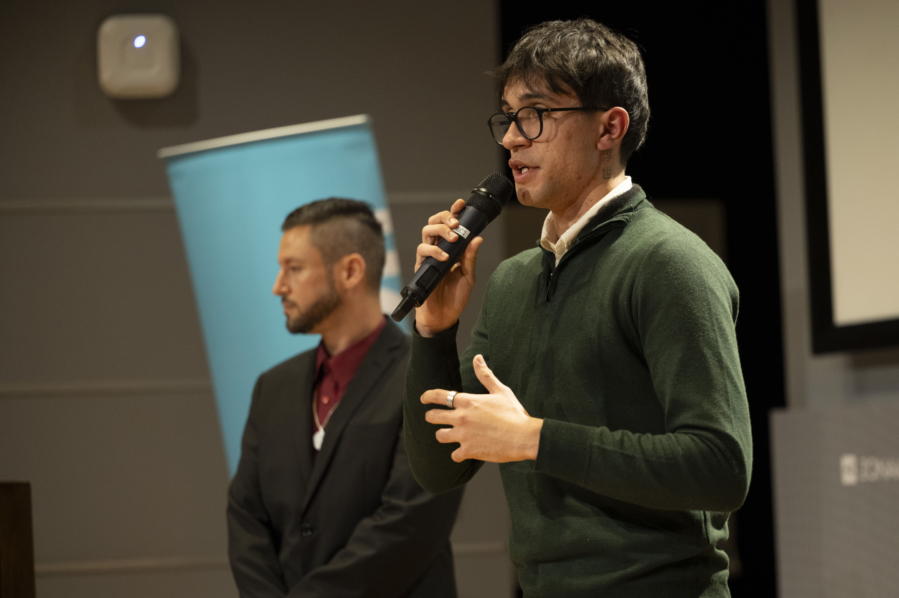

# 🎮 Welcome to My Dev Game!

## 🕹️ Select Your Option:
🔹 **[About Me](#-about-me)**  
🔹 **[Skills](#-skills)**  
🔹 **[Projects](#-projects)**  
🔹 **[Stats & Achievements](#-stats--achievements)**  
🔹 **[Portfolio](#-portfolio)**  
🔹 **[Download CV](#-download-cv)**  

---

<div align="center">
  
  
  # Santiago Fleitas
  
  <p><i>Software Developer | ML Enthusiast | Tech Gamer</i></p>
  
  <a href="https://github.com/SantiagoFleitasIbarra"></a>
  <a href="https://www.linkedin.com/in/santiago-mauricio-fleitas-ibarra-852075280/"></a>
  <a href="https://santiagofleitasibarra.github.io/SantiagoFleitas-Portfolio/"></a>
  
  

  
</div>

## 👾 About Me


- 💾 **Software Developer | ML Enthusiast | Tech Gamer**
- 🎓 **Graduate of Holberton School** (Specialized in Machine Learning)
- 🎓 Currently studying **Computer Engineering** at Universidad de la República (UdelaR)
- 🚀 Passionate about coding, problem-solving, and game-like experiences
- 🛠️ Focused on Backend, Frontend, and AI Development

> "Coding is my ultimate adventure! I approach every challenge like a game level waiting to be conquered."

<br clear="right"/>

---

## 🎯 Skills
```
🛠️ Frontend  : [██████████] 100%
💻 Backend    : [██████████] 100%
📊 Database   : [██████    ] 60%
🤖 AI & ML    : [█████     ] 50%
🔗 DevOps     : [███       ] 30%
```

### 🚀 Tech Stack:
### Frontend


### Backend


### Moblie & Otros


---

## 🚀 Projects

This portfolio showcases some of my most significant projects:

### [IbaEduca]() 🎓
Educational platform for selling online courses with content management system, video playback, and payment processing.
- **Status:** Currently working

### [WordHunter (CazaPalabras)](https://santiagofleitasibarra.github.io/CazaPalabras-Juego-2025/) 🎮
Wordle-style game where users must find hidden words.
- **Technologies:** JavaScript, HTML5, CSS3
- **[Demo](https://santiagofleitasibarra.github.io/CazaPalabras-Juego-2025/)** | **[Repository](https://github.com/SantiagoFleitasIbarra/CazaPalabras-Juego-2025)**

### [Fun English (Inglés Divertido)](https://santiagofleitasibarra.github.io/ingles-divertido/) 📚
Interactive platform designed to make learning English more enjoyable and effective.
- **Technologies:** HTML5, CSS3, JavaScript
- **[Demo](https://santiagofleitasibarra.github.io/ingles-divertido/)** | **[Repository](https://github.com/SantiagoFleitasIbarra/ingles-divertido)**

### [Organize Your Day with Joy](https://santiagofleitasibarra.github.io/Organiza-tu-dia/) 📝
Task management application with a pleasant and intuitive interface.
- **Technologies:** HTML5, CSS3, JavaScript
- **[Demo](https://santiagofleitasibarra.github.io/Organiza-tu-dia/)** | **[Repository](https://github.com/SantiagoFleitasIbarra/Organiza-tu-dia)**

### [Warded](https://www.youtube.com/watch?v=Lfbt74-kG8c) 🔒
Mobile application that creates safe communities through private groups. Developed the complete backend including notification system and database management.
- **Technologies:** Flutter, Jira, Figma, Firebase
- **[Demo Day Presentation](https://www.youtube.com/watch?v=Lfbt74-kG8c)**

### [Scientific Calculator](https://santiagofleitasibarra.github.io/calculadora-cientifica/) 🧮
Advanced tool for complex mathematical calculations with adaptable and multilingual interface.
- **Technologies:** JavaScript, HTML5, CSS3
- **[Demo](https://santiagofleitasibarra.github.io/calculadora-cientifica/)** | **[Repository](https://github.com/SantiagoFleitasIbarra/calculadora-cientifica)**

### [Online Library](https://santiagofleitasibarra.github.io/Libreria-Online/) 📚
Platform for publishing and downloading free ebooks across multiple categories.
- **Technologies:** HTML5, CSS3, JavaScript
- **[Demo](https://santiagofleitasibarra.github.io/Libreria-Online/)** | **[Repository](https://github.com/SantiagoFleitasIbarra/Libreria-Online)**

---

## 📬 Contact Me

Feel free to reach out to me through any of these channels:

- 📧 **Email**: [santiagofle8@gmail.com](mailto:santiagofle8@gmail.com)
- 📱 **Phone**: +598 92 564 819
- 🔗 **LinkedIn**: [linkedin.com/in/santiagofleitas](https://www.linkedin.com/in/santiago-mauricio-fleitas-ibarra-852075280/)
- 🐙 **GitHub**: [github.com/santiagofleitas](https://github.com/SantiagoFleitasIbarra)
- 📄 **Resume**: [Download my CV](https://github.com/SantiagoFleitasIbarra/SantiagoFleitas-Portfolio/blob/main/pdf/Santiago%20Fleitas%20-%20Curriculum.pdf)

> "The only way to do great work is to love what you do. If you haven't found it yet, keep looking. Don't settle." — Steve Jobs
